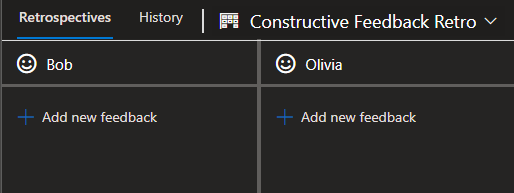

Companies around the world have an annual review process, but why?  There's mutual disdain from both sides of the process, employees and their managers alike.  So, where does that come from? 

## The Problems

> __*NOTE:*__ For context, the review process I'll be identifying problems for is where employee's have a yearly assessment.  Wherein peers anonymously answer some close and open ended questions.  The information in those reviews is then relayed to the reviewee by a manager that's uninvolved with the reviewee's team.
>

First off, managers dislike how much time it takes out of their schedule.  Having to do a 30+ minute meeting for every person they manage is time consuming.  Managers may also be uncomfortable handing out feedback they haven't seen themselves.  Beyond that, managers don't want to be viewed as the "bad guy" when they have to dish out negative feedback.

It's not very self-organizing, since the review process is often a mandate from upper management.  As a result, employee satisfaction is worse as they don't have the autonomy to decide how they receive feedback.  Moreover, employees are more likely to not give and receive feedback well.

People may not want to give negative feedback to their coworkers, even if it's constructive.  Why?  Often, out of empathy, as people don't want it to negatively impact the reviewee's standing in the company.  The reviewer may also think their feedback is insignificant.  Whether that's because the feedback is a small detail or they think the reviewee may have changed, causing the feedback to be unhelpful and or outdated.

Speaking of outdated, the feedback loop is far too long.  [62% of employees want to receive feedback more frequently](https://officevibe.com/state-employee-engagement).  These long feedback loops cause a few issues.  For one, the reviewers are likely to have recency bias.  With the large amount of time passing, they may forget the reviewee's accomplishments or even their shortcomings.  They also may give inaccurate feedback, not just because they're forgetful, but also because things change.  For example, a reviewee is on a team for the 1st 4 months of the review period, they then switch to a new team where they remain for the next 8 months.  Once the review period ends, people from the reviewee's 1st team give negative feedback.  That feedback ceases to represent reality, as the reviewee has grown past the issue while on their new team.  Along the same lines, if the reviewee received that feedback during their time on the 1st team they would've been able to grow faster and be a better teammate.  As the reviewee, it sucks to have some glaring flaw, that may be easily fixed, but you're only made aware of it many months later.  Further, from the organization's and team's standpoint, think about how much value is lost by not alerting the reviewee of their issues early on. 

You may ask, why not just have the reviews occur more often than once a year then?  Well, there's still an unnecessary layer of communication.  In other words, `reviewers -> manager <-> reviewee`.  Wherein the reviewers aid in providing the manager with information and the manager and reviewee converse back and forth about it.  With a line of communication like this, what happens when feedback is ambiguous?  Or the reviewee has questions about the feedback?  Or the manager relays the reviewer's comments incorrectly?  What do these questions all have in common?  The manager lacks the context (that the reviewers have) to effectively resolve these questions.  Further, [64% of employees think the quality of the feedback they receive is insufficient](https://officevibe.com/state-employee-engagement).  Naturally, managers who don't work alongside the reviewee are more likely to struggle giving quality feedback.

## Enter, the Constructive Feedback Retro

So, how do we resolve these problems?  Move the review process straight into the hands of the team.  Team members give negative *and* positive feedback to all their teammates and discuss it in real-time.  This is *the constructive feedback retro*.  It solves all the problems listed above.

1. Managers are happy because it takes some of the burden off of them.
2. It's self-organizing as the team is able to control how and when it happens, as well as whether or not individuals want to participate.
3. People are more likely to give honest feedback as they don't fear managerial wrath.
4. The length of the feedback loop is up to the team, so they're able to avoid the aforementioned pain points of a long feedback loop.
5. The extra, unnecessary layer of communication is removed as you're conversing with and receiving feedback from people who are directly within your team.  Instead of `reviewers -> manager <-> reviewee` it simply becomes `reviewers <-> reviewee`.

Further, note that the name of this retro format is constructive *feedback* and **not** constructive *criticism*.  It's valuable to see what teammates value in yourself and your peers through the feedback they give, whether that's positive or negative.  [Organizations who give *positive* feedback to employees experience a 14.9% lower turnover rate](https://news.gallup.com/businessjournal/147383/secret-higher-performance.aspx).  

With that, how does this type of retrospective actually work at a lower-level?

### The Format

1. Find a retro board. You likely have already used one at some point, but some examples are [IdeaBoardz](https://ideaboardz.com/) and the [Azure DevOps Retrospectives extension](https://marketplace.visualstudio.com/items?itemName=ms-devlabs.team-retrospectives). 

   > **_NOTE:_** Using a retro board is important because it's more difficult to forget going over pieces of feedback.  Furthermore, it allows the retro participants to give more honest feedback as they can do so without speaking and with anonymity. 

2. Next, make a section on the retro board for each member of your team, so they can receive feedback.  For example, with a team consisting of 2 people, Bob and Olivia, it would look like the following:

   

3. Now that you have the basic setup you can start the meeting.  Take a small portion of time at the beginning to have everybody enter their feedback (both positive and negative) onto the retro board for everybody's respective section.

4. Once everybody has their feedback in, go through each person's section and read aloud the feedback to everybody in the group.  People can provide context or ask questions about the feedback as they see fit.

It's worth considering adjusting the duration of the meeting based on 

* whether or not your team has done this before,
* the amount of time that's passed since doing one of these types of retros, and
* the size of your team.  

For our 1st time, after 6 months of being on a team with each other, with a team of 8 people we budgeted 1 hour in total for the meeting and spent the 1st 10 minutes adding feedback to the retro board.

### Guidelines & Suggestions

* Make it clear that this retro is a place to give *constructive* feedback.  The feedback should be actionable, don't give unhelpful or unfixable feedback.
* Encourage your teammates to thoroughly think about what feedback they plan to give before the meeting even starts.
* Let people opt-in to the event.  This type of retro is a lot more personal than most retro formats.  With that in mind, it's important to give people the choice on whether or not they want to participate.
* Keep the specific details of the feedback within your team.  In order for people to give and receive feedback well, it's important that criticisms don't go higher up the chain (e.g. managers).
* Find an appropriate interval for your team to conduct these constructive feedback retros (e.g. quarterly).

## Manager Feedback

Now, this isn't to say review processes by managers in longer cycles aren't valuable, just that they're insufficient as the only mechanism for feedback.  Organization's still need to measure performance in some regard.  Moreover, it's valuable for employees to have 1 on 1 time with their manager, so 

* they can get an outsider's perspective on their work,
* voice concerns with the job, and 
* figure out more ways to grow with somebody who has the power to influence it.

 

So, what do you think?  What ways can you see to improve review processes?  Is there anything you would do to improve this format?  Should you introduce your team to the constructive feedback retro?