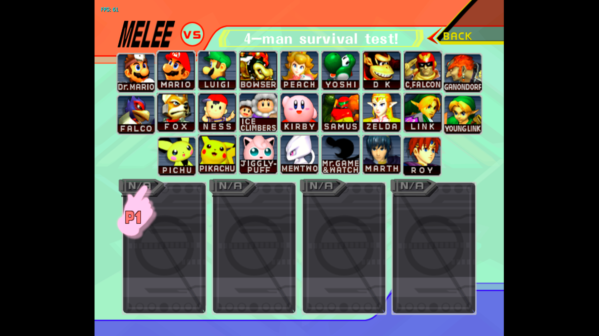
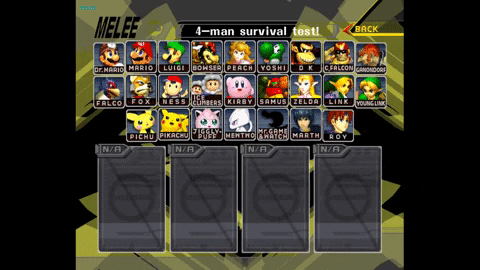
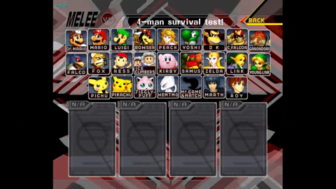
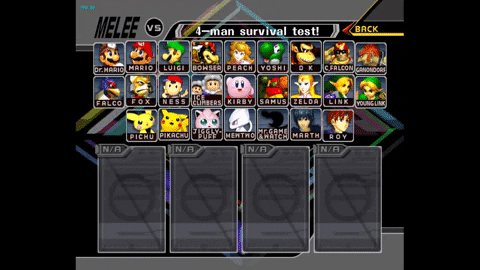
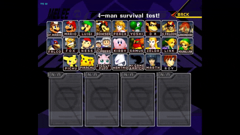
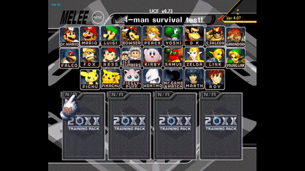

I was looking into projects I could do for my favorite game, Super Smash Bros. Melee that wouldn't be invasive to the actual gameplay.  So, I had the idea to modify the character select screen (CSS) which included things like character portraits, colors, and music.  The most interesting portion of this to me was changing the colors, so that's what this post will be covering.  For reference here is what the original CSS looks like:


## Introduction to Format Types

First you need the file that the game uses to store data for the CSS, this is the MnSlChr.usd which can be received by splitting an .iso (a Gamecube game file) file using a tool like [GCRebuilder](https://gamebanana.com/tools/6410).

There are a few ways to go about reading and modifying the file, but this post will detail methods using hexadecimal.  The MnSlChr.usd file contains a sequence of bytes that signify a specific format and these formats indicate locations of the following:

* Transparency value - Only really used to make something invisible or not.

* Primary color - Typically the fill of something (RR GG BB).

* Secondary color - Typically the border of something (RR GG BB).

Formats can indicate other things, but that's out of the scope of this post as my project uses only 2 different formats, 07 07 07 and 42 48. 

### 07 07 07 Format

The 07 07 07 format identifier **precedes** the data.


The transparency value for 07 07 07 format rarely ever does anything and in this project has no effect at all.

### 42 48 Format

The 42 48 format identifier **follows after** the data.


This format can be made transparent by setting the 4 transparency bytes to 00 00 00 00, which can lead to some interesting visuals, which we'll get into later.


## Hunting for Offsets

As there are 4,128,784 offsets in the file that contains the CSS data, finding the offsets that control what you want is tedious, it's mostly a process of trial and error where you 

1. Open a hex editor for the file
2. Change the primary and or secondary colors of arbitrary offsets based on their format
3. Build that file back into an .iso
4. Load the .iso into an emulator
5. Squint hard to try to see any changes to the game
6. Most likely be disappointed, but if you actually found something look back through the hex and correlate the color you saw in game with an offset and document it
7. Repeat 2-6 until you're satisfied

I found the offsets for this project through a combination of this method and sifting through forum posts from half a decade ago, finding only 1 relevant post with poorly written documentation, posted by me.

Here's a table of offsets that were used in the project:

| 42 48 Format | Starting Offset |
| --------------- | --------------- |
| Background | 0x000958 |
| Selects in Background | 0x000984 to 0x0019D8 |

| 07 07 07 Format | Starting Offset |
| --------------- | --------------- |
| Bottom Frame | 0x348E88 |
| Cursor | 0x01005C |
| Top Frame | 0x349008 |
| Rules | 0x348F48 |

Here's some input and output from the program I made, *Melee CSS Color Changer*, to show what these offsets control:




The "Selects in Background" aren't shown here because the "Background" masks them pretty well.  In the next section we'll see how to get around that.


## Writing Colors to the File

Once these offsets are found the color replacement is pretty simple.  It's mostly just changing 2 colors (6 bytes) worth of data and sometimes making something transparent (4 bytes in 42 48 format). 

The way I did this programmatically is by taking the starting offset and adding/subtracting hex to get to the correct position for primary color, secondary color, or transparency value and then writing to the file for the number of bytes required.  I accomplished this through Java's RandomAccessFile object.  Lets start with some basic code that changes the color of the top frame of the CSS, which is a 07 07 07 format offset: 

```java
final TOP_FRAME_STARTING_OFFSET = 0x349008;
RandomAccessFile raf = new RandomAccessFile(filename);
raf.seek(TOP_FRAME_STARTING_OFFSET + 0x04); //get to primary color starting offset
//Writing red to the primary color
raf.write(0xFF);
raf.write(0x00);
raf.write(0x00);
raf.seek(TOP_FRAME_STARTING_OFFSET + 0x08); //get to secondary color starting offset
//instead of the above we could have just skipped 1 byte ahead by doing raf.read()
//Writing green to the secondary color
raf.write(0x00);
raf.write(0xFF);
raf.write(0x00);
```

Next we'll look at some code that makes the background transparent, which is a 42 48 format offset:

~~~java
final BACKGROUND_STARTING_OFFSET = 0x000958;
RandomAccessFile raf = new RandomAccessFile(filename);
raf.seek(BACKGROUND_STARTING_OFFSET - 0x04); //puts cursor at start of transparency bytes
//write 0x00 4 times to fill the 42 48 format transparency value to make it transparent
raf.write(0x00);
raf.write(0x00);
raf.write(0x00);
raf.write(0x00);
~~~


Now that our background is transparent we can see the once practically hidden selects in the background.  There's 16 of them and each character ("S", "e", "l", "e", "c", "t") has it's own offset, so there's 96 offsets in total.  Here's an algorithm to change all 96 of them with random colors:

```java
final static int SELECT_BACKGROUND_OFFSET_START = 0x000984;
final static int SELECT_BACKGROUND_OFFSET_END = 0x0019D8;
RandomAccessFile raf = new RandomAccessFile(filename);

for (int currentOffset = SELECT_BACKGROUND_OFFSET_START; currentOffset <= SELECT_BACKGROUND_OFFSET_END; currentOffset += 0x01) {
    raf.seek(currentOffset); //Go to current offset location
    if (raf.read() == 0x42 && raf.read() == 0x48) { //is a 42 48 format
        Format4248 format = new Format4248(currentOffset);
        double red = Math.random();
        double green = Math.random();
        double blue = Math.random();
        Color color = new Color (red, green, blue, 1);
        HexRGB rgb = new HexRGB(color); //Custom class that changes Color object into hex
        
        //Want both primary and secondary colors to be the same so it's a solid color
        raf.seek(format.getPrimaryColorOffset()); //currentOffset - 0x10
        raf.write(rgb.red);
        raf.write(rgb.green);
        raf.write(rgb.blue);
        raf.seek(format.getSecondaryColorOffset()); //currentOffset - 0x0C
        raf.write(rgb.red);
        raf.write(rgb.green);
        raf.write(rgb.blue);
    }
}
```

Here's a possible result of running this:


## Example Character Select Screens

Now that we know some of the algorithms that can be used to modify the CSS, here are some other examples that can be made using the program:













## Closing

In general there's still much that can be done with Melee modding, more color offsets, tools for competitive players, features for casual play, animations, models, and more.  If you're interested in getting started or seeing what's already been done head over to the [Melee Workshop](<https://smashboards.com/forums/melee-workshop.271/>). 

If you want to see the full code for this project you can take a look at it on [here on GitHub](<https://github.com/RodneyMcQuain/Melee-CSS-Color-Changer>).  