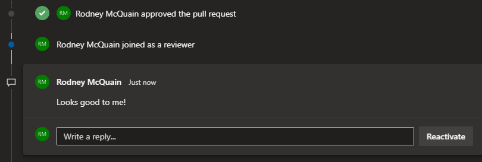

Have you ever ran into this situation right after spending countless hours developing a new feature?

It can be a little confusing.  I know my code isn't perfect.  I know my reviewers are competent.  I know my reviewers are being thorough.  Surely my code can be improved somehow.  So, why don't I get any feedback in my code review?  

Well, there are a few things that are within your control that make your reviewers' lives easier and in turn lead to receiving valuable feedback.

> *NOTE*: I'll be using git terms in the following advice.  This is to keep it simple and use terms that the most amount of people will be familiar with, but all of these techniques likely apply to whatever version control system you use.

## Ask Questions

Asking questions on your own code review is one of the best ways to get interaction in a review.  Call out specific parts of your code and enumerate any qualms you have about them.  Here are some examples:

* Can anybody think of a more readable way of writing this?  Is it too clever?
* This could have poor performance as we get more users.  Does anybody know of a fix?  Should this be handled later?
* Would our users easily understand this error message?  Is there a more familiar word than ——— to them?
* If ——— is null it could cause issues.  Is it worth being defensive here?
* When writing this I was under the assumption of ———.  Is this assumption correct?  If not, how should I handle ———?
* Here's a picture of what the new feature looks like ———.  Does anybody foresee any user experience problems with ———?
* Is this worth refactoring right now?  I could see ——— and ——— becoming issues in the future because ———.

Calling out specific parts of your own code does a few things:

* lets your reviewers know you're open to feedback
* gives reviewers a starting point for their review
* cues people into potential issues with your code that would've otherwise gone unnoticed
* starts the conversation
* documents and answers important questions surrounding your work
* creates decision points that the whole team can have a say in
* gives the reviewee another avenue to think through their code for any shortcomings
* provides less friction for reviewers to give meaningful feedback

## Refine the Work

Not everybody has the same context as you.  This only becomes more true as you spend numerous hours working through a given product backlog item.  So, it's important that you take the time to document that context for your reviewers.  These are some good candidates for documentation:

* why the work is being done
* what it means for this work to be considered complete
* any assumptions you've made
* a picture of the updated UI
* why specific technical decisions were made
* business knowledge that's involved in the work

Having well refined documentation for your code review is good for a few reasons:

* it's easier for your reviewers to identify bigger picture problems, such as architectural shortcomings
* it answers questions that reviewers didn't know they had
* it answers questions that people have, but didn't ask because they thought the answer wouldn't be very significant
* with the extra information, reviewers can give more educated, thorough, and accurate feedback

## Keep It Small

Keep the code review small.  Working memory allows for somewhere around [4 things to be ready for mental use at once](https://journals.sagepub.com/doi/abs/10.1177/0963721409359277). The significance here being: the less code your review covers—the better the reviewer is able to reason about the bigger picture surrounding your code.  Allowing your reviewers to comment on the more important parts of the code, the code that determines how a codebase will grow in the years to come.

For example, you may want to have separate code reviews for a lot of namespace renames and code that involves purely functional changes.  Reason being: if they are combined into one review—due to the limitations of working memory—the namespace renames create a lot of noise that take attention away from reviewing the functional changes, whether consciously or not.

Sometimes it may not be possible nor make sense to split code reviews, due to things like process, time, or technical restrictions.  If this is the case, split up your commits.  Give them a single responsibility.  This allows your reviewers to go through the code iteratively, in a similar fashion to how you developed it. 

There are a few guidelines that you can follow to facilitate this.  From my view—there are 3 categories of commits:

* Feature: code that—from the user's perspective—noticeably impacts them, such as new functionality
* Chore: code that has little or no noticeable impact to the user, such as refactoring or system reliability improvements
* Bug: code that was intended to be correct, but has some sort of defect

If it can be helped, don't mix any of these 3 types of code in a single commit.  Another signifier to split a commit up is if the commit message includes *connective words*, such as "and."  If there are any *connective words*, consider separating the code and commit messages into multiple commits. 

And don't forget, if your code review has this sort of commit organization, make sure to cue your reviewers in so they can take advantage of it.

## Wrap Up

To summarize, these are a few techniques you can use to get more interaction and value out of your code reviews:

* ask questions to directly get people involved with the review
* refine the work so reviewers understand what they're reviewing
* make code reviews and commits small to lessen the cognitive load of the reviewers 
