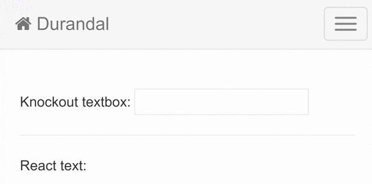
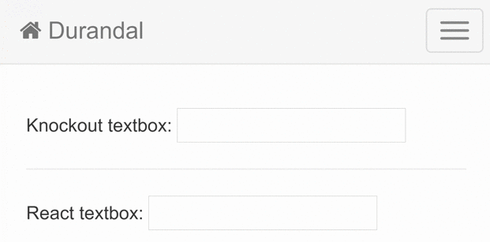

I was put onto a project at work that started around 2011, ancient by web standards. It uses [Durandal](http://durandaljs.com/), basically a SPA framework that uses [Knockout](https://knockoutjs.com/) as the UI library. I'm not the biggest fan of Knockout, so I decided to try to make Knockout interoperable with [React](https://reactjs.org/), for incremental adoption. So, here are some of the steps I went through to achieve this.

## Setting Up a Custom Binding

Knockout has this concept of [custom bindings](https://knockoutjs.com/documentation/custom-bindings.html), these bindings can be specified in your views and allow for rendering DOM elements. So, we'll utilize this for a React binding:

~~~JSX
// custom 'react' binding
ko.bindingHandlers.react = {
	update: render
}

function render(element, valueAccessor) {
    const { Component, ...props } = valueAccessor();

    ReactDOM.render(
    	<Component {...props} />, 
    	element
    );
}
/* '<Component {...props} />,' could be replaced by
'React.createElement(Component, props),' 
if you don't want JSX in the binding */
~~~

Before explaining how this works, here's how it can be used in a view with a corresponding view model:

~~~HTML
<!-- Knockout view -->
<div 
    data-bind="react: { 
    	Component: ReactComponent, 
    	anyPropNameIWant: theFirstPropName,
    	aDifferentPropName: anotherProp
    }"
></div>
~~~

~~~JavaScript
// Durandal/RequireJS/Knockout view model based on the Durandal starter kit's pattern
define([
    '../bindings/React', //A normal app might instead make this binding global
    './ReactComponent'
], function (reactBinding, ReactCounter) {
	var constructor = function() {
        this.ReactComponent = ReactComponent;
        this.theFirstPropName = 55;
        this.anotherProp = 'wow another prop';
    }
    
    return constructor;
});
~~~

The binding uses 2 parameters, `element` and `valueAccessor`. Where `element` represents the DOM element that the custom binding was placed on, in this example, it would be the div. The second parameter, `valueAccessor` is a function that returns the object specified in the binding, in this example it would be the object that contains the keys and corresponding values of `Component`, `anyPropNameIWant`, and `aDifferentPropName`.

### The element Parameter 

The `element` parameter (the div) is used by the [ReactDOM.render() API](https://reactjs.org/docs/react-dom.html#render) to render the React component inside of the div and subsequently [reconcile](https://reactjs.org/docs/reconciliation.html) the component.

### The valueAccessor Parameter

The `valueAccessor` parameter is [destructured](https://developer.mozilla.org/en-US/docs/Web/JavaScript/Reference/Operators/Destructuring_assignment) and uses the [spread operator](https://developer.mozilla.org/en-US/docs/Web/JavaScript/Reference/Operators/Spread_syntax) so that the prop names aren't strict or hard coded and can be anything the client of this binding wants. JSX spread is then used on the React component to apply all of the specified props.

#### An Aside on JSX Spread

[JSX spread is consider to be an anti-pattern](https://codeburst.io/react-anti-pattern-jsx-spread-attributes-59d1dd53677f). To my knowledge, given we want the clients of our binding to use any name they want for their React props, JSX spread would be required unless we disallowed custom prop names in favor of something like `prop1`, `prop2`, `prop3`, etc. that every client of the binding must use. Personally, I value the developer experience and the less complex binding more than the additional, likely negligible re-renders.

## One-way Binding

One-way binding, meaning the flow of data only goes from Knockout to React for reconciliation, works pretty seamlessly with the above custom binding. All that needs to be done is to pass the value of a Knockout observable as a prop to the custom binding, as follows:

~~~HTML
<!-- Knockout view -->
<div 
    data-bind="react: { 
    	Component: ReactComponent, 
    	valueOfObservable: anObservable()
    }"
></div>
~~~

Where `anObservable` is defined in the view model to the effect of:

~~~JavaScript
anObservable = ko.observable('')
~~~

In Knockout the update function in custom bindings are called on initialization and when something like an observable is updated. In this example, when `anObservable` is updated, by doing something like `anObservable('new value')`.

This would cause a call to the update function and thus pass the prop(s) down to the React component for reconciliation.

### The Result

Now lets see what one-way binding would actually look like:


To accomplish this the Knockout view would look something like this:

```HTML
<p>Knockout textbox:&nbsp; 
    <input type="text" data-bind="textInput: aTextObservable" />
</p>

<div data-bind="react: {
		Component: OneWayBinding,
   		text: aTextObservable()
	}"
></div>
```

where `aTextObservable` is an observable defined in the Knockout view model and where the `OneWayBinding` React component would be:

```JSX
    const OneWayBinding = ({ text }) => {
        const [displayText, setDisplayText] = React.useState(text);

        React.useEffect(() => {
            setDisplayText(text);
        }, [text]);

        return (
            <p>
                React textbox:&nbsp;
                <input 
                    type="text" 
                    value={displayText} 
                    onChange={e => setDisplayText(e.target.value)} 
             	/>
            </p>
        );
    }
```

The [useEffect](https://reactjs.org/docs/hooks-effect.html) hook here is called when `aTextObservable` gets a new value (i.e. something like `aTextObservable('New text')`). When called it sets the the text displayed for the React textbox. The `useEffect` hook in this example could be omitted if you didn't want/need to be able to update the text for the React textbox through typing in it.

If you don't need to maintain local state in the React component that's based on something like a Knockout observable then you could instead do this:

```JSX
const OneWayBinding = ({ text }) => <p>React text: {text}</p>
```

which would result in this:




## Two-way Binding

Two-way binding, meaning:

* Knockout passing something like an observable into a React component for reconciliation.
* Updates inside the React component to the passed in observable also propagate back to Knockout, triggering any related events (updating the view, triggering observable subscriptions, etc.).

gets quite a bit uglier.

### The Problem

We now have a problem, as stated before, the update function in Knockout custom bindings are only triggered when a property in the binding is updated. So, the problem here is how do we get changes to properties in the React component to propagate back to Knockout? The fairly straightforward approach is to pass a reference of something like an observable, as opposed to the value of the observable, into the binding so that React can update that observable, this would be done simply like this:

~~~HTML
<!-- Knockout view -->
<div 
    data-bind="react: { 
    	Component: ReactComponent, 
    	observableReference: anObservable
    }"
></div>
~~~

As you may have noticed this still doesn't solve the problem because when the value of the observable is changed the update function will not be called again because the reference to the observable obviously will not have changed.

### A Solution 

My, admittedly clunky, solution is to pass in the value of the observable to the binding so the update function in the binding is actually called when the observable changes, similar to the one-way binding methodology:

~~~HTML
<!-- Knockout view -->
<div 
    data-bind="react: { 
    	Component: ReactComponent, 
    	observableReference: anObservable,
        dummy: anObservable()
    }"
></div>
~~~

Unfortunately, with this method the `dummy` property duplicates data that is already present in the object, subsequently passes unused/unnecessary things into the React component, and burdens the clients of this binding with additional complexity. This was the answer I came to, but there's probably something better out there, if you have any ideas I'd liked hear about it!

With this solution the same custom React binding is used, but there's still some work to be done to improve the developer experience on the React side of things. 

#### Custom Observable Hook

For ease of use with the passed in observable reference (`anObservable` from the previous example), here's a custom hook that's basically just the normal [useState API](https://reactjs.org/docs/hooks-state.html): 

~~~JavaScript
function useObservableState(observable) { // Where observable is a reference
    const [value, setValue] = React.useState(observable())

    const updateNormalAndObservableState = state => {
        observable(state);
        setValue(state);
    }
    
    React.useEffect(() => {
        setValue(observable()); 
    }, [observable()])

    return [value, updateNormalAndObservableState];
}
~~~

The only differences, are that when:

* You use the set function you are also updating the observable, which will also trigger events back in Knockout land. 

* The observable is updated in Knockout the `useEffect` hook syncs the local state in the React component with the updated observable value.

### The Result

Now lets see what two-way binding would actually look like: 



To accomplish this the Knockout view would look something like this:

```HTML
<p>Knockout textbox:&nbsp; 
    <input type="text" data-bind="textInput: aTextObservable" />
</p>

<div data-bind="react: {
 		Component: TwoWayBinding,
		textObservable: aTextObservable,
		dummy: aTextObservable()
	}"
></div>
```

where `aTextObservable` is an observable defined in the Knockout view model and where the `TwoWayBinding` React component would be:

```JSX
const TwoWayBinding = ({ textObservable }) => {
	const [displayText, setDisplayText] = useObservableState(textObservable);

	return (
		<p>
			React textbox:&nbsp;
			<input 
				type="text" 
				value={displayText} 
				onChange={e => setDisplayText(e.target.value)} 
			/>
		</p>
	);
}
```

where `useObservableState` is the aforementioned custom hook.

## Closing

Knockout was a good library for its time, but with it no longer really being maintained, having a smaller ecosystem, and lacking some of the simplicity and good ideas of React, it's a good time to at least give React a shot. I hope this post will facilitate you and/or your team to try out the future of UI programming.